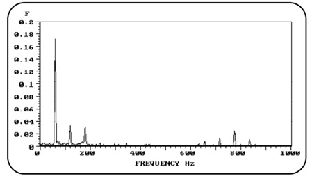

# Vibration Analysis in Rotating Machinery

Welcome to my repository on **Vibration Analysis in Rotating Machinery**. This repository includes an article I authored on Vibration Analysis, an essential field within mechanical engineering. The study focuses on the **Fast Fourier Transform (FFT)** method, widely used to identify and analyze frequency components in rotating machinery systems.

My foundational knowledge in vibration analysis directly contributed to my work at General Motors, where I applied these concepts in a vibration monitoring project as part of a maintenance initiative aimed at predicting failures. This project achieved significant cost reductions by enabling early detection of mechanical issues through effective vibration monitoring.

---

## Article Overview

The article explores:

- **Types of Maintenance**: Examining the three main maintenance strategies (Corrective, Predictive, and Preventive), with a focus on predictive maintenance.
- **Principles of Vibration Analysis**: Understanding how different types of vibrations impact machinery performance.
- **FFT (Fast Fourier Transform) Method**: A detailed exploration of FFT as a tool for decomposing vibration signals to identify critical frequencies, aiding in fault diagnosis.

For full details, read the article here:
- [Vibration Analysis in Rotating Machinery (PDF)](Vibration Analysis in Rotating Machinery.pdf)

---

## Real-World Application: Internship at General Motors

During my internship at General Motors, I applied the principles from this article to develop a vibration monitoring system that resulted in:

- **Early Fault Detection**: Identifying potential issues before they escalated.
- **Cost Savings**: The vibration monitoring project led to significant reductions in maintenance costs and improved machinery uptime.

---

## Contact

If you’re interested in discussing vibration analysis or have questions, feel free to connect with me on [LinkedIn](https://www.linkedin.com/in/gustavo-maldonado-saffiotti) or check out my [GitHub Profile](https://github.com/Gustavo-Saffiotti).
